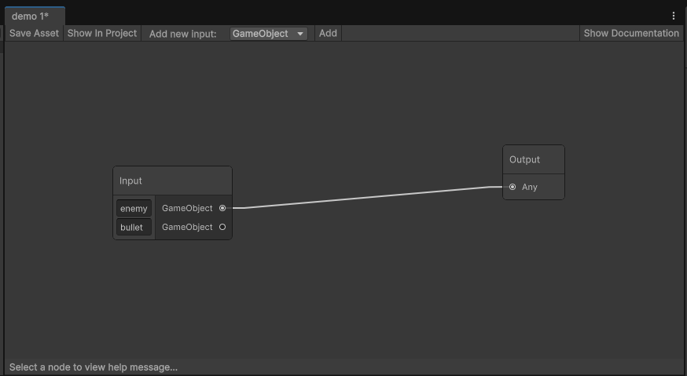

# Interface

The MeshGraph window indicates numerous things, lets explore them from the top left corner all the way to the bottom.
 - Window name: the assets name which is edited in the window,
 - (*): appears when the graph is not saved,
 - 'Save Asset': saves the asset,
 - 'Show In Project': navigates the project explorer to the asset,
 - 'Add new input (type) | Add': the type specifies what type of input should be added, the  - 'Add' button adds the type to the input node,
 - 'Show Documentation': opens this webpage,
 - GRAPH_VIEW: an interface for the nodes and edges (we will discuss this further below),
 - Toolbar: at the bottom, a useful hint can be seen for each node if there is one (and only one) selected

The graph view area:
You can use the keystrokes you are used to:
  - f - selection to focus
  - Ctrl+x - cut selection
  - Ctrl+c - copy selection to clipboard
  - Ctrl+v - paste clipboard
  - Ctrl+z - undo
  - Ctrl+y - redo
  - scroll - zoom in/out
  - middle mouse button - pan
  - right mouse button - context menu
  - left mouse button - select
  - space - add new node

These options are mostly reachable from the right click (context) menu.

If you want to make an edge, you have to start one by drawing a line from one of the nodes' input or output ports. Then you have two options:
 - connect to an other existing node's compatible port, not compatible ports will be disabled.
 - The other option is to drop the edge on the canvas, this will open the node creation dialog, with the compatible node types. The new nodes fist compatible port will be used in the connection.
